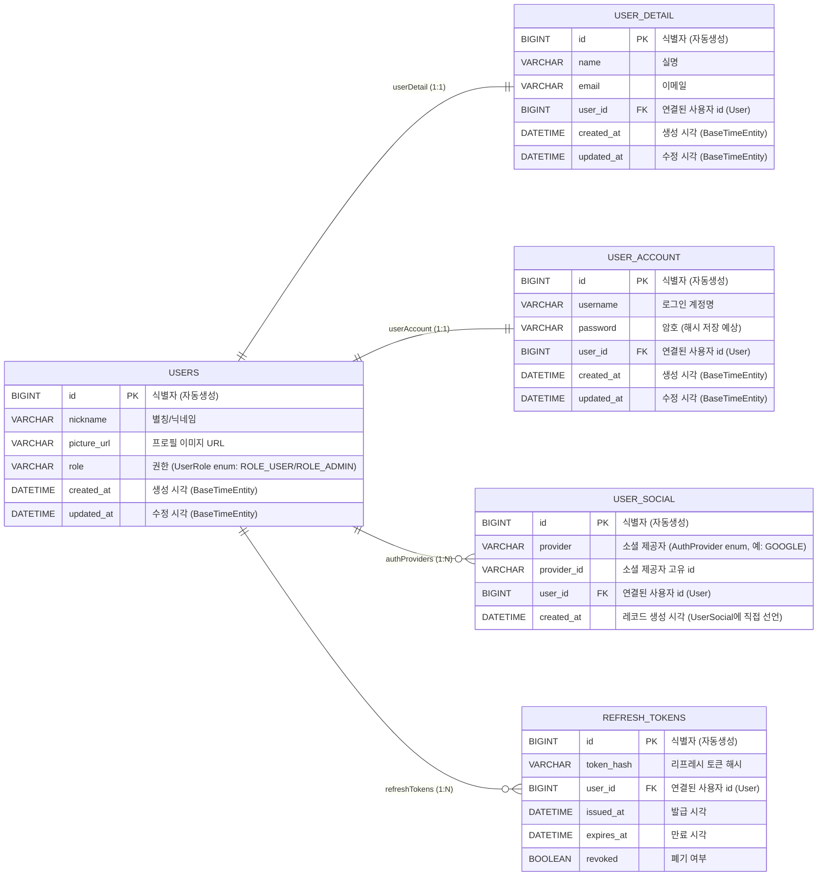
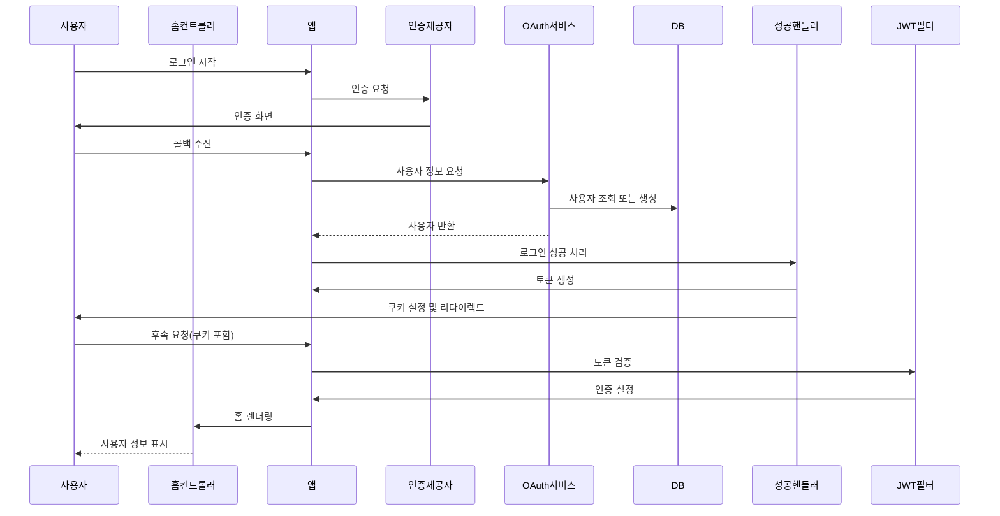
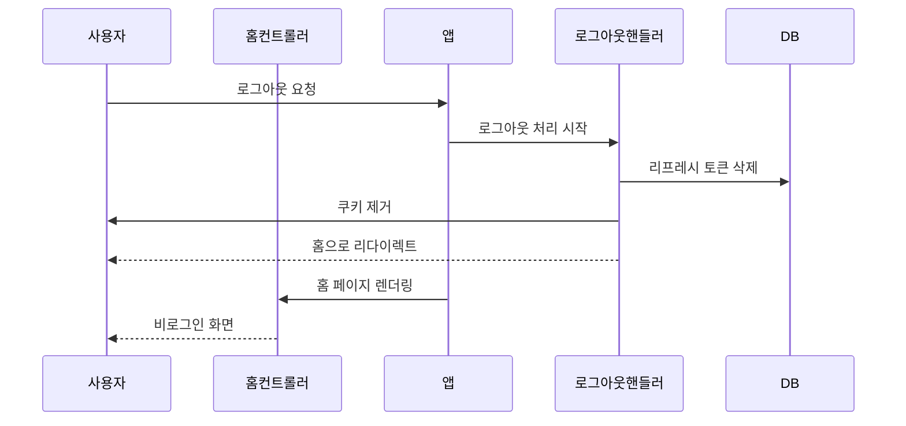

# login-app

## 개요
Google OAuth2로 로그인하고, 로그인 성공 시 JWT 액세스 토큰과 리프레시 토큰(raw)을 쿠키로 전달합니다. 리프레시 토큰은 서버에 SHA-256 해시로 저장합니다. 개발용 H2 데이터베이스와 Thymeleaf + Bootstrap 기반 UI를 제공합니다.

## 화면 시안

### 로그인


### 로그아웃


## ERD




## 시퀀스 다이어그램

### 로그인



### 로그아웃



## 설정(빠른 체크)
`src/main/resources/application.properties`에서 다음 값을 확인/수정하세요:
- `spring.security.oauth2.client.registration.google.client-id`
- `spring.security.oauth2.client.registration.google.client-secret`
- `app.jwt.secret` (JWT 서명용)
- `app.jwt.expiration-ms`, `app.refresh-token.expiration-ms`
- `app.cookie.secure` (개발: false, 운영: true)
- JPA 설정(`spring.jpa.hibernate.ddl-auto`)은 운영 환경에서 적절히 변경

## 실행 (Windows)
프로젝트 루트에서:

```cmd
gradlew.bat clean build
gradlew.bat bootRun
```
웹브라우저에서 `http://localhost:8080/` 접속
H2 콘솔: `http://localhost:8080/h2-console`

## 주의사항
- 실제 운영 시 `app.jwt.secret`과 OAuth 클라이언트 시크릿을 환경변수 또는 시크릿 매니저로 관리하세요.
- `spring.jpa.hibernate.ddl-auto=create-drop`는 개발 전용입니다.
- HTTPS(또는 `app.cookie.secure=true`) 환경에서 쿠키 보안을 반드시 적용하세요.