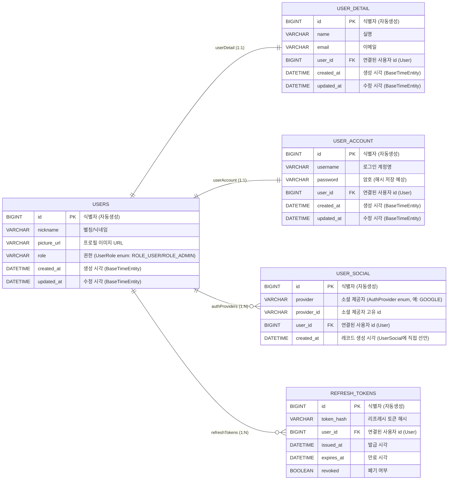
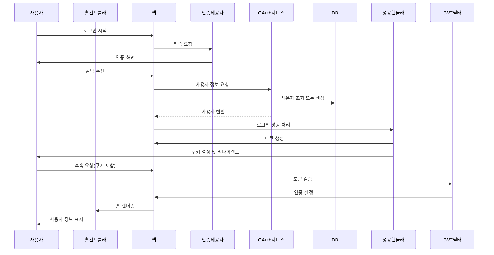
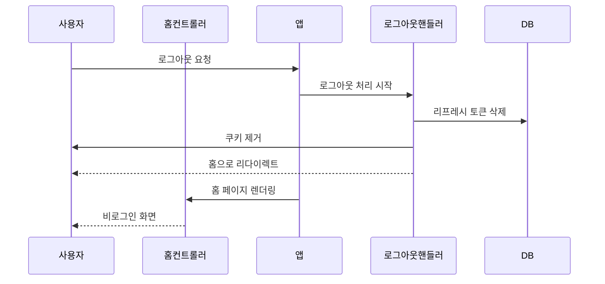

# login-app

## 개요

Google OAuth2로 로그인하고, 로그인 성공 시 JWT 액세스 토큰(access token)과 리프레시 토큰(refresh token, raw)을 쿠키로 전달하는 간단한 예제 Spring Boot
애플리케이션입니다. 리프레시 토큰은 서버에 SHA-256 해시로 저장하여 원본 토큰을 안전하게 관리합니다. 개발용으로 H2 인메모리 데이터베이스와 Thymeleaf 기반의 UI(부트스트랩 포함)를 제공합니다.

주요 기능

- Google OAuth2 로그인 연동
- JWT 액세스 토큰 발급 및 쿠키 전송
- 리프레시 토큰 저장(해시) 및 관리
- H2 DB(개발용), Thymeleaf 템플릿, Bootstrap UI

### 개발 환경

  
  
  

  
  
  

  
  
  

## 화면 및 다이어그램

### 로그인

### 로그아웃

## ERD

## 시퀀스 다이어그램

### 로그인

### 로그아웃

## 요구사항 (로컬 개발)

- Java 17 이상 (프로젝트 설정에 따라 다름)
- Gradle Wrapper (프로젝트에 포함됨)
- 인터넷 연결 (Google OAuth2 인증을 위해)

## 설정

애플리케이션 설정은 `src/main/resources/application.properties` 또는 운영 환경의 환경 변수로 제공합니다.
다음 값들을 반드시 설정하세요:

- spring.security.oauth2.client.registration.google.client-id
- spring.security.oauth2.client.registration.google.client-secret
- app.jwt.secret (JWT 서명용 비밀)

예시(환경변수 사용 권장)

- 윈도우 cmd 예시:

  setx SPRING_SECURITY_OAUTH2_CLIENT_REGISTRATION_GOOGLE_CLIENT_ID "your-client-id"
  setx SPRING_SECURITY_OAUTH2_CLIENT_REGISTRATION_GOOGLE_CLIENT_SECRET "your-client-secret"
  setx APP_JWT_SECRET "your-jwt-secret"

(참고: 실제 운영에서는 환경변수나 시크릿 매니저를 사용하세요.)

## 빌드 및 실행 (Windows)

프로젝트 루트에서 다음 명령을 실행합니다:

gradlew.bat clean build
gradlew.bat bootRun

정상 실행 시 브라우저에서 http://localhost:8080/ 접속
H2 콘솔: http://localhost:8080/h2-console (개발 중에만 사용)

테스트 실행:

gradlew.bat test

## 보안 주의사항

- `app.jwt.secret`과 OAuth 클라이언트 시크릿은 절대 버전관리 시스템에 커밋하지 마세요.
- 운영 환경에서는 HTTPS를 사용하고 `app.cookie.secure=true`를 설정하세요.
- `spring.jpa.hibernate.ddl-auto=create-drop` 또는 `update` 설정은 운영에 적합하지 않을 수 있습니다.

## 디렉터리 (주요)

- src/main/java/.../controller : 컨트롤러
- src/main/java/.../service : 서비스 로직
- src/main/java/.../repository : JPA 리포지토리
- src/main/resources/templates : Thymeleaf 템플릿
- src/main/resources/application.properties : 환경설정

## 가정 및 참고

- 이 README는 로컬 개발 환경을 기준으로 작성되었습니다.
- OAuth 클라이언트 등록(구글 콘솔)과 리디렉션 URI 설정은 사용자가 직접 수행해야 합니다.
